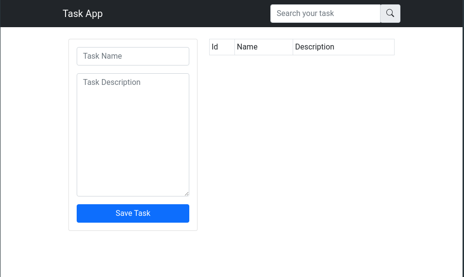

## Acerca de esta aplicación

Esta mini aplicación fue creada siguiendo el siguiente [ejemplo](https://www.youtube.com/watch?v=GeCNShiLdpc&t=6913s) de AJAX con PHP del canal de YouTube [Fazt Code](https://www.youtube.com/channel/UCMn28O1sQGochG94HdlthbA) aunque haciendo cambios mínimos en las tecnologías utilizadas y en los estilos, con el fin de poner en práctica los conocimientos que he ido adquiriendo, entre ellos se encuentran: 

- PHP
- JavaScript
- JQuery
- HTML5
- CSS3
- Bootstrap
- Laravel
- MySql
